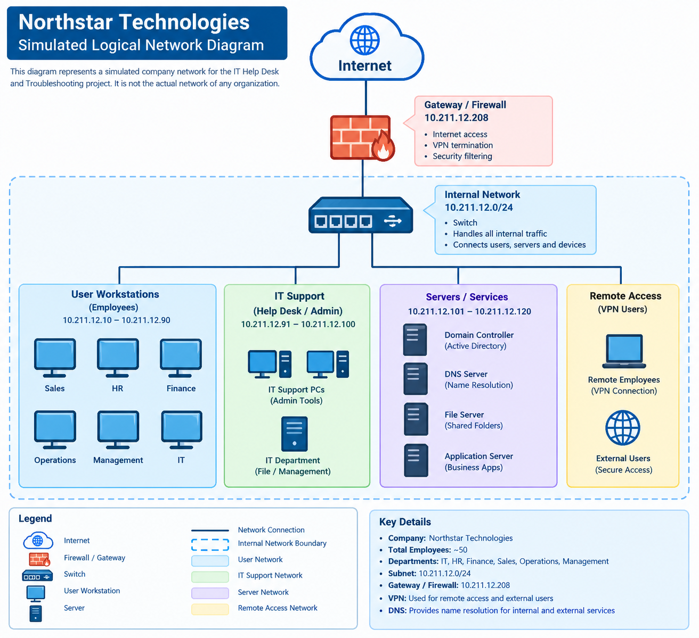

# IT Help Desk & Troubleshooting Simulation

## Project Overview

This project simulates the day-to-day activities of an IT Help Desk technician in a small enterprise environment.

The objective was to investigate common technical support incidents, perform structured troubleshooting, identify root causes, document resolutions, and recommend preventive actions.

The simulated organization is **Northstar Technologies**, a fictional company with approximately 50 employees across departments such as IT, HR, Finance, Sales, Operations, and Management.

---
---
---

## Quick Navigation

- [Environment](1.Environment/)
- [Incident Tickets](2.Tickets/)
- [Troubleshooting Guides](3.Troubleshooting/)
- [Root Cause Analysis](4.Root-Cause-Analysis/)
- [Preventive Actions](5.Preventive-Actions/)

## Network Diagram

The following diagram represents the simulated logical network environment used for this project.

> **Note:** This is a fictional, educational network diagram created for the troubleshooting simulation. It does not represent a production company network.

---

## Project Objectives

- Investigate common IT support incidents.
- Apply structured troubleshooting methodologies.
- Use Windows administrative and diagnostic tools.
- Collect technical evidence before making configuration changes.
- Identify probable root causes.
- Document incidents professionally.
- Verify troubleshooting results.
- Recommend preventive actions.

---

## Incidents Investigated

| Ticket | Incident | Primary Skills |
|---|---|---|
| INC-001 | Network Connectivity | TCP/IP, Ping, IP Configuration, Tracert |
| INC-002 | DNS Resolution | DNS, Nslookup, Network Testing |
| INC-003 | VPN Connection | Windows VPN, Network Services |
| INC-004 | Account Lockout | Local Users, Event Viewer, Security Logs |
| INC-005 | Permission Denied | NTFS Permissions, User Access |
| INC-006 | Software Issue | Application Troubleshooting, Event Viewer |

---

## Tools Used

### Windows Tools

- Command Prompt
- `ipconfig`
- `ping`
- `nslookup`
- `tracert`
- Event Viewer
- Computer Management
- Local Users and Groups
- Services
- Network Connections
- Windows Settings
- Task Manager
- NTFS Security Permissions

---

## Troubleshooting Methodology

The project followed a structured troubleshooting process:

1. Understand the reported symptoms.
2. Gather information.
3. Reproduce the problem when possible.
4. Start with the simplest possible checks.
5. Collect technical evidence.
6. Identify the likely root cause.
7. Apply an appropriate resolution.
8. Verify the result.
9. Document the incident.
10. Recommend preventive actions.

---

## Project Structure

IT-Helpdesk-Troubleshooting/
│
├── README.md
├── .gitignore
│
├── 1.Environment/
│   └── Permission-Lab/
│       └── Finance-Confidential.txt
│
├── 2.Tickets/
│   ├── INC-001-Network-Connectivity/
│   │   └── incident-report.md
│   ├── INC-002-DNS-Resolution/
│   │   └── incident-report.md
│   ├── INC-003-VPN/
│   │   └── incident-report.md
│   ├── INC-004-Account-Lockout/
│   │   └── incident-report.md
│   ├── INC-005-Permissions/
│   │   └── incident-report.md
│   └── INC-006-Software-Issue/
│       └── incident-report.md
│
├── 3.Troubleshooting/
│   ├── network-troubleshooting.md
│   ├── dns-troubleshooting.md
│   ├── vpn-troubleshooting.md
│   ├── account-troubleshooting.md
│   └── software-troubleshooting.md
│
├── 4.Root-Cause-Analysis/
│   └── incident-summary.md
│
└── 5.Preventive-Actions/
    └── recommendation.md